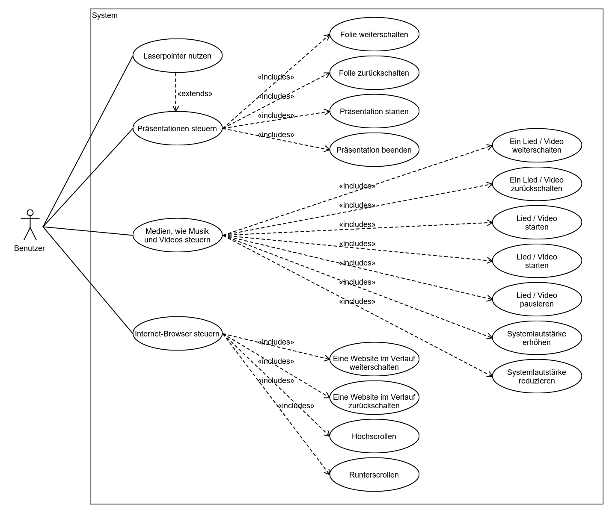
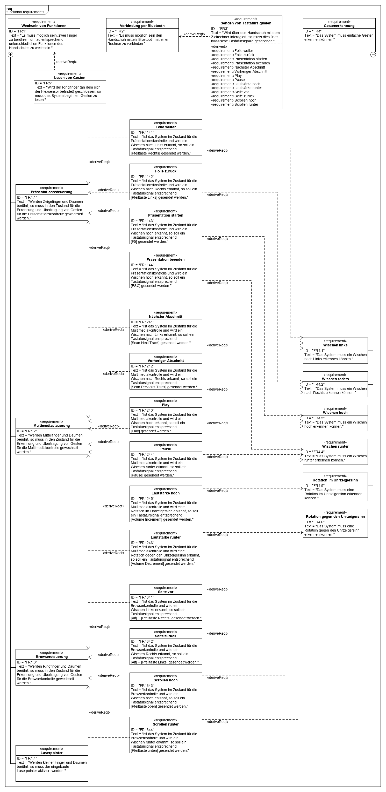
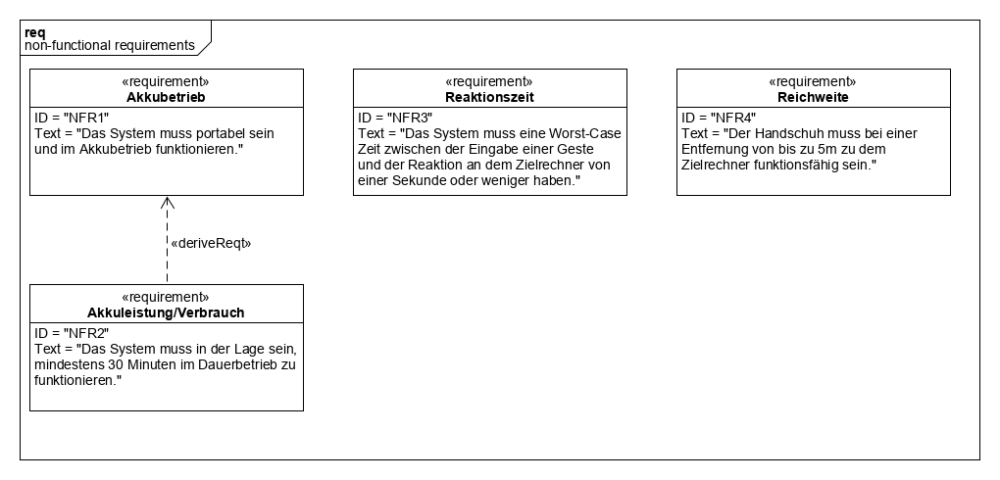
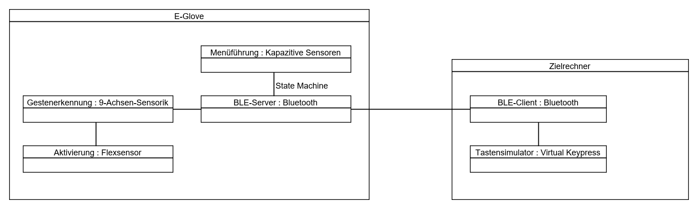
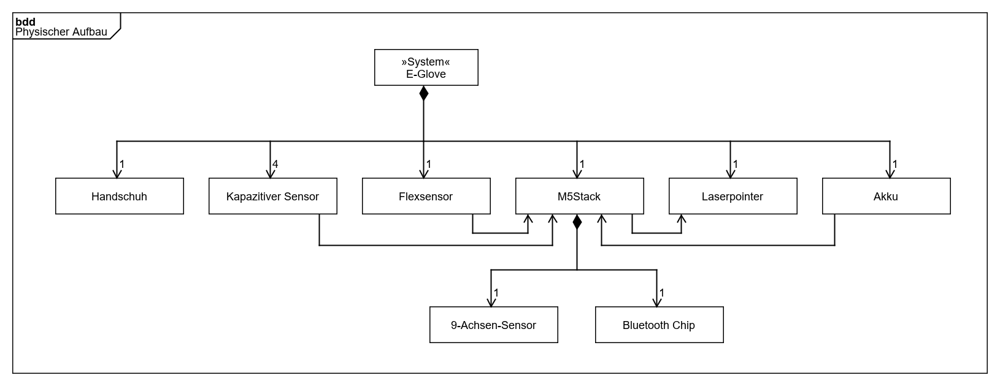
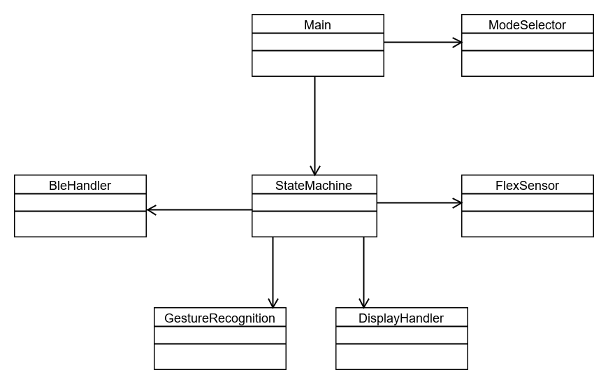
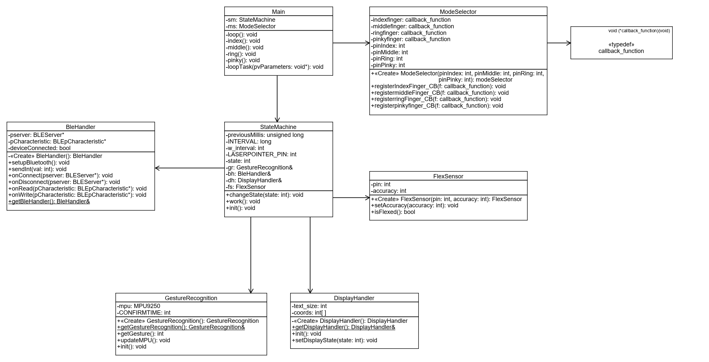

# E-Glove
## Entwurfsspezifikation
### Autoren
Luis Deutsch
Phillip Penner

### Inhaltsverzeichnis

# 1 Einführung

## 1.1 Beschreibung
Unter dem Projektnamen "E-Glove" wird ein Eingabegerät für (Windows) Rechner entwickelt, welches unter anderem die intuitive Steuerung von Präsentationen ermöglichen soll. Bei dem Gerät handelt es sich um einen Handschuh, also ein "wearable"-Gerät, welches sich per Bluetooth mit einem Zielrechner verbindet und im Akkubetrieb funktioniert. Der E-Glove wird an der rechten Hand getragen und erkennt bestimmte Gesten um daraufhin Befehle an einen Zielrechner zu senden. Sensoren an den Fingerspitzen bieten eine simple Form von Menüführung, um zwischen verschiedenen Funktionalitäten des Handschuhs zu wechseln, so ist beispielsweise die Kontrolle von Präsentationen, sowie Multimedia und von Browsern möglich. Für alle Funktionalitäten werden aber nur wenige unterschiedliche Gesten benötigt, die intuitiv mit der jeweiligen Funktion assoziierbar sind, wodurch der Umgang mit dem E-Glove einfach erlernbar ist. Beispielsweise führt eine Wischbewegung nach Links dazu, dass in einer Präsentation eine Folie weiter geschaltet wird, ein Verhalten, welches bereits ähnlich bei Smartphones genutzt wird und welches seinen Ursprung wohl bei dem Umblättern von Seiten eines Buches hat.

## 1.2 Ziele
    - Anwendungsbereiche, Motivation, Umfang, Marktanforderungen, Alleinstellungsmerkmale
    - Informationen zu Zielbenutzergruppen und deren Merkmale (Bildung, Erfahrung, Sachkenntnis)
    - Abgrenzung (Was ist das Softwaresystem _nicht_)

# 2 Anforderungen

## 2.1 Funktionale Anforderungen
### 2.1.1 Use Case Diagramm

### 2.1.2 Anforderungsdiagramm

## 2.2 Nicht-funktionale Anforderungen

### 2.2.1 Anforderungsdiagramm

### 2.2.2 Rahmenbedingungen
    - Normen, Standards, Protokolle, Hardware, externe Vorgaben
#### Verwendete Hardware
**M5Stack Core (+ Starter Kit)**
https://m5stack.com/collections/m5-core/products/m5go-iot-starter-kit-stem-education

- Betrieben durch einen ESP32.
- Bietet viele bereits eingebaute Features an (z.B. LCD-Farbdisplay, 3 Tasten, Lautsprecher, ...).
- Für uns hauptsächlich relevant:
	- Bluetooth-Funktionalität (BLE).
		- Für die kabellose Kommunikation mit dem Zielrechner, der gesteuert werden soll.
	- 9-Achsen-Sensor
		- Das enthaltene Gyroskop, sowie der Beschleunigungssensor werden genutzt, um die Gesten zu erkennen.

**Flexsensor**
https://www.antratek.de/flex-sensor-2-2?gclid=EAIaIQobChMIppH7n8m35QIVmMx3Ch376AAcEAQYAyABEgJ9efD_BwE

- An dem Ringfinger-Rücken besfestigt.
- Hat eine Länge von ca. 5,5 cm.
- Hat bei geradem Zustand einen geringen Widerstand und bei zunehmender Biegung erhöht sich auch der Widerstand.
- Wenn der Sensor (und damit der Ringfinger) gebogen ist, heißt dies, dass der Benutzer eine Geste zur Steuerung des Zielrechners ausführen will.

**Punkt Lasermodul**
https://www.reichelt.de/punkt-lasermodul-rot-650-nm-03-6-vdc-9x20-mm-klasse-1-pico-70132441-p254487.html

- Mittels einer 3D-gedruckten Halterung am Zeigefinger befestigt
- Erweiternd zu den Präsentationsfunktionen des E-Glove als Zeigewerkzeug genutzt.

**Bluetooth USB 2.0 Adapter**
https://www.reichelt.de/micro-bluetooth-usb-2-0-adapter-v4-0-edr-logilink-bt0015a-p170030.html?&trstct=pol_0

- Adapter, der dem angeschlossenen Rechner Bluetooth-Funktonalitäten verleiht.
- Für die Nutzung mit Rechnern, die keine eingebaute Bluetooth-Funktonalität besitzen.

**Kapazitiver Berührungssensor x4**
https://www.reichelt.de/entwicklerboards-kapazitiver-beruehrungssensor-debo-touch-p253985.html

- Befestigt an allen Fingerspitzen, außer dem Daumen.
- Dienen zur Auswahl der verschiedenen Modi des Handschuhs ("Menüführung").
- Der Daumen ist bei dem E-Glove frei, mit diesem weden die Sensoren betätigt.

### 2.2.3 Betriebsbedingungen
    - Vorgaben des Kunden (z.B. Web Browser / Betriebssystem Versionen, Programmiersprache)
#### Fremde Vorgaben
1. Als Kernelement soll der **M5Stack Core** (https://m5stack.com/) genutzt werden.
2. Als Framework für die Software-Entwicklung auf dem M5Stack, soll das **ESP-IDF** (https://github.com/espressif/esp-idf) genutzt werden.
	2.1. Es sollen die Funktionalitäten von **FreeRTOS** (https://www.freertos.org/) genutzt werden, um Tasks zu erstellen und zu verwalten.
3. Als Programmiersprache (auf dem M5Stack) soll **C / C++** genutzt werden.

### 2.2.4 Qualitätsmerkmale
    - Externe Qualitätsanforderungen (z.B. Performance, Sicherheit, Zuverlässigkeit, Benutzerfreundlichkeit)

## 2.3 Graphische Benutzerschnittstelle
    - GUI-Mockups

## 2.4 Anforderungen im Detail
    - User Stories mit Akzeptanzkritierien 
    - Optional: Name (oder ID) und Priorität ("Muss", "Soll", "Kann")

### Schablone für User Stories

| **Als** | **möchte ich** | **so dass** | **Akzeptanz** |
| :------ | :----- | :------ | :-------- |
| Wer | Was | Warum | Wann akzeptiert |

### Beispiel 1

| **Als** | **möchte ich** | **so dass** | **Akzeptanz** |
| :------ | :----- | :------ | :-------- |
| Benutzer | bei Fehleingabe die Lösung angezeigt bekommen | ich lernen kann | Lösung wird angezeigt |

### Beispiel 2

| **Name**| **In meiner Rolle als**...|   ...**möchte ich**...   | ..., **so dass**... | **Erfüllt, wenn**... | **Priorität**   |
|:-----|:----------:|:-------------------|:-------------|:---------|:----------------|
| Lernen  |Benutzer| bei Fehleingabe die Lösung angezeigt bekommen|ich lernen kann| Lösung wird angezeigt | Muss |

# 3 Technische Beschreibung

## 3.1 Systemübersicht
    - Systemarchitekturdiagramm ("Box-And-Arrow" Diagramm)
    - Schnittstellenbeschreibung
    - Kommunikationsprotokolle, Datenformate
### 3.1.1 Strukturdiagramm

### 3.1.2 Blockdefinitionsdiagramm: Physischer Aufbau

### 3.1.3 Kommunikationsprotokoll
Der E-Glove und der Zielrechner kommunizieren über Bluetooth, wobei der E-Glove als Server fungiert und der Zielrechner als Client.
Für den kompletten Ablauf der Kopplung zwischen Server und Client siehe 3.4, vereinfacht kann aber gesagt werden:
1. Der Server (E-Glove) bietet einen Service mit einer Charakteristik an.
2. Der Client (Zielrechner) sucht nach dem Service und abonniert dann die Charakteristik, um bei jeder Änderung des Wertes der Charakteristik benachrichtigt zu werden.
3. Der Server (E-Glove) schreibt Daten in die Charakteristik.
4. Der Client (Zielrechner) liest die Daten aus der Charakteristik.
...

**Werte, die in die Charakteristik geschrieben werden und welche virtuelle Taste sie auslösen:**
(Siehe "Microsoft Virtual-Key Codes" als Referenz: https://docs.microsoft.com/en-us/windows/win32/inputdev/virtual-key-codes)

| **Wert** | **Virtuelle Taste** | **Hexadezimalwert der virtuellen Taste** |
| :------ | :----- | :----- |
| 1 | RIGHT ARROW key | 0x27 |
| 2 | LEFT ARROW key | 0x25 |
| 3 | F5 key | 0x74 |
| 4 | ESC key | 0x1B |
| 5 | Next Track key | 0xB0 |
| 6 | Previous Track key | 0xB1 |
| 7 | Play/Pause Media key | 0xB3 |
| 8 | Volume Up key | 0xAF |
| 9 | Volume Down key | 0xAE |
| 10 | Browser Forward key | 0xA7 |
| 11 | Browser Back key | 0xA6 |
| 12 | UP ARROW key | 0x26 |
| 13 | DOWN ARROW key | 0x28 |

## 3.2 Softwarearchitektur
    - Darstellung von Softwarebausteinen (Module, Schichten, Komponenten)

## 3.3 Datenmodell 
    - Konzeptionelles Analyseklassendiagramm

## 3.4 Abläufe
    - Aktivitätsdiagramme für relevante Use Cases
    - Aktivitätsdiagramm für den Ablauf sämtlicher Use Cases

## 3.5 Entwurf
    - Detaillierte UML-Diagramme für relevante Softwarebausteine
### 3.5.1 Klassendiagramm (vereinfacht)

### 3.5.2 Klassendiagramm (vollständig)

# 4 Projektorganisation

## 4.1 Annahmen
    - Nicht durch den Kunden definierte spezifische Annahmen, Anforderungen und Abhängigkeiten
    - Verwendete Technologien (Programmiersprache, Frameworks, etc.)
    - Einschränkungen, Betriebsbedingungen und Faktoren, die die Entwicklung beeinflussen (Betriebssysteme, Entwicklungsumgebung)
    - Interne Qualitätsanforderungen (z.B. Softwarequalitätsmerkmale wie z.B. Erweiterbarkeit)

## 4.2 Verantwortlichkeiten
    - Zuordnung von Personen zu Softwarebausteinen aus Kapitel 3.1 und 3.2
    - Rollendefinition und Zuordnung

## 4.3 Grober Projektplan

### Meilenstein 1 (Bis: 18.11.2019)
Handschuh bauen und in die Komponenten einarbeiten.

### Meilenstein 2 (Bis: 02.12.2019)
Kabellose Verbindung zum Zielrechner herstellen und Signale übertragen.

### Meilenstein 3 (Bis: 30.12.2019)
Registrierung von Gesten.

### Meilenstein 4 (Bis: 13.01.2020)
Zusammenführung der Funktionen.

# 5 Anhänge

## 5.1 Glossar 
    - Definitionen, Abkürzungen, Begriffe

## 5.2 Referenzen
    - Handbücher, Gesetze

## 5.3 Index

